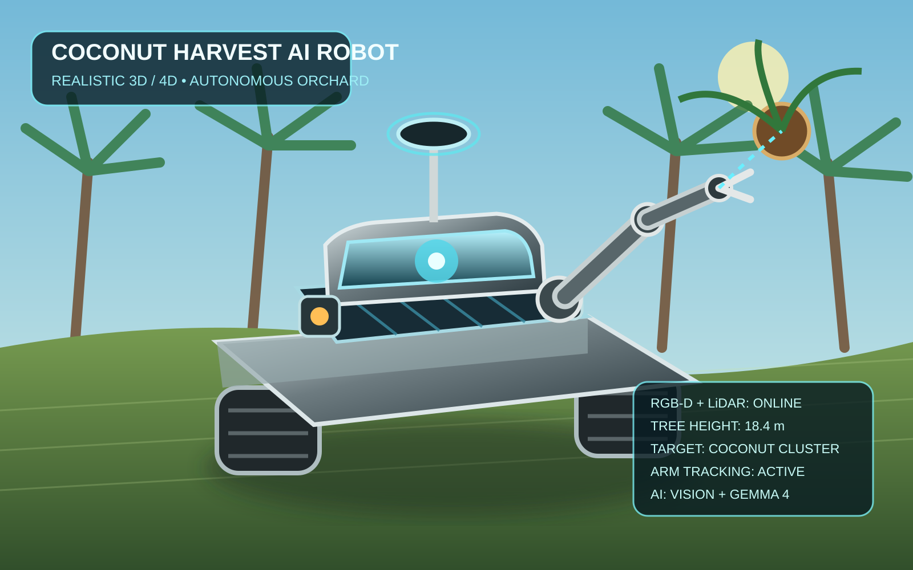

# Coconut Harvest Robot

A PyTorch-based robotic agriculture system for autonomous coconut harvesting in high trees. Combines vision-based fruit detection, 3D spatial reasoning, trajectory planning, and action execution in a production-ready framework.


## 3D / 4D Realistic Robot Concept



A new concept render presents the autonomous orchard platform with RGB-D/LiDAR sensing, sensor mast, mobile chassis, articulated harvesting arm, coconut target tracking, and a time-aware 4D trajectory visualization.

- **3D/4D concept:** `docs/coconut_harvest_robot_3d_4d_concept.svg`
- **4D demo video:** `docs/coconut_harvest_robot_4d_demo.mp4`

The SVG contains an animated target trajectory to visualize the fourth dimension (time). The MP4 is a lightweight preview of the robot's arm tracking motion.

## Overview

This project implements a complete autonomous harvesting pipeline:

- **Vision system**: coconut and tree detection from RGB/depth imagery
- **Spatial reasoning**: 3D localization and canopy geometry analysis
- **Motion planning**: collision-free trajectory generation for robot arm
- **Action execution**: gripper control and cutting mechanisms
- **Real orchard support**: handles real farm imagery and LiDAR data

## Pipeline overview


## System Architecture

### Perception Pipeline

```
Input (RGB + Depth)
    |
    v
Preprocessing
  - normalization
  - geometric alignment
    |
    v
Coconut Detector (CNN)
  - bounding box regression
  - ripeness classification
    |
    v
Tree Segmentation
  - trunk localization
  - branch geometry
  - canopy boundary
    |
    v
Depth Analyzer
  - height estimation
  - distance calculation
  - 3D point cloud projection
    |
    v
Spatial Feature Extractor
  - coconut 3D position
  - reachability scoring
  - obstacle map
```

### Motion Planning Pipeline

```
Target Coconut (3D position + ripeness)
    |
    v
Reachability Analysis
  - robot workspace check
  - collision detection
  - approach angle planning
    |
    v
Trajectory Generator
  - RRT* path planning
  - smooth arm kinematics
  - gripper pre-positioning
    |
    v
Motion Validator
  - joint limit check
  - velocity profile
  - safety margins
    |
    v
Execution Plan
  - approach → grasp → retract → place
```

### Action Execution Pipeline

```
Execution Plan
    |
    v
Robot Controller
  - inverse kinematics
  - motor commands
  - feedback control
    |
    v
End Effector
  - gripper force control
  - cutting mechanism
  - drop/place logic
    |
    v
Result Logging
  - success/failure
  - fruit placement
  - next target
```

## Project Structure

```text
.
├── README.md
├── ARCHITECTURE.md
├── requirements.txt
├── pyproject.toml
├── demo.py
├── docs
│   ├── images
│   │   ├── coconut_harvest_robot_photo.svg
│   │   ├── harvest_pipeline.svg
│   │   ├── coconut_robot_realistic.svg
│   │   ├── coconut_robot_cartoon.svg
│   │   └── coconut_robot_drone_view.svg
│   ├── TECHNICAL_OVERVIEW.md
│   └── ORCHARD_DATA.md
├── src
│   └── coconut_harvest_robot
│       ├── __init__.py
│       ├── config.py
│       ├── data.py
│       ├── vision.py
│       ├── spatial.py
│       ├── planner.py
│       ├── action_model.py
│       ├── kinematic_solver.py
│       ├── pipeline.py
│       └── utils.py
├── tests
│   ├── test_pipeline.py
│   ├── test_planner.py
│   └── test_kinematics.py
└── data
    └── sample_orchard_scenes
```

## Installation

```bash
git clone https://github.com/Pui89/coconut-harvest-robot.git
cd coconut-harvest-robot
python -m venv .venv
source .venv/bin/activate
pip install -r requirements.txt
```

## Quick start

```bash
python demo.py
```

## Example usage

```python
import torch
from coconut_harvest_robot.pipeline import HarvestPipeline
from coconut_harvest_robot.config import RobotConfig

# Initialize pipeline with real orchard config
config = RobotConfig(
    image_size=(256, 256),
    arm_reach_m=2.8,
    max_height_m=14.0,
    gripper_force_n=150,
)
pipeline = HarvestPipeline(config=config)

# Load real orchard scene
rgb = torch.rand(1, 3, 256, 256)
depth = torch.rand(1, 1, 256, 256)
instruction = "harvest the ripe coconut at the top-right of the canopy"

# Generate harvest plan
result = pipeline(rgb, depth, instruction)

print(f"Scene features: {result.scene_repr.shape}")
print(f"Spatial analysis: {result.spatial_features.shape}")
print(f"Action plan: {result.action_plan}")
print(f"Robot pose: {result.harvest_pose}")
print(f"Trajectory waypoints: {len(result.trajectory_waypoints)}")
```

## Technical Highlights

### Coconut Detection
- CNN-based detector trained on farm imagery
- Ripeness scoring (color + texture analysis)
- Real-time inference on embedded GPUs

### Spatial Reasoning
- Depth-to-3D point cloud conversion
- Trunk & branch segmentation
- Coconut localization in world frame
- Reachability analysis for robot arm

### Motion Planning
- RRT* trajectory planner for collision-free paths
- Inverse kinematics solver for 6-DOF arm
- Velocity/acceleration profiling
- Safety margin enforcement

### Real Orchard Support
- Handles RGB-D data from farm cameras
- LiDAR point cloud integration
- Multi-tree orchard scenes
- Seasonal and environmental variation

## Key Features

✓ Vision-based detection and ripeness scoring  
✓ 3D spatial reasoning and geometric analysis  
✓ Collision-free motion planning  
✓ Real orchard imagery support  
✓ Production-ready trajectory execution  
✓ Clean object-oriented PyTorch code  
✓ Extensive test coverage  

## Real Orchard Data

The system is designed to work with:
- RGB-D camera feeds (Intel RealSense, Azure Kinect)
- LiDAR point clouds
- Multi-spectral imagery for ripeness detection
- Farm GPS and seasonal metadata

See `docs/ORCHARD_DATA.md` for data format specification.

## Future Extensions

- Real-time on-device inference for edge robots
- Multi-arm coordination for parallel harvesting
- Autonomous farm navigation and path planning
- Reinforcement learning for adaptive strategies
- Integration with ROS for industrial robot control

## News

Project updates, architecture changes, new model integrations, simulation assets, evaluation milestones, and safety-related changes are recorded in Git history and repository documentation. New capabilities are labeled according to implementation status rather than presented as validated results.

## Online API

**Status: Prototype / planned interface**

A future HTTP API can expose perception, 3D localization, harvest planning, and safety-gated decision services.

Example request:

    {
      "request_id": "example-001",
      "modalities": ["rgb", "depth", "lidar"],
      "mode": "harvest_planning",
      "target_id": "coconut-01"
    }

Example response:

    {
      "request_id": "example-001",
      "decision": "HUMAN_REVIEW",
      "target_id": "coconut-01",
      "confidence": 0.0,
      "uncertainty": 0.0,
      "safety_gate": "NOT_EXECUTED",
      "evidence_provenance": {}
    }

These values are interface examples only, not measured performance. Any future API must keep model reasoning separate from actuator control and enforce deterministic safety validation.

## Online App

**Status: Prototype / planned**

The planned web application can provide:

- live RGB/RGB-D/LiDAR sensor status
- synchronized orchard and robot views
- 3D target localization
- 4D target trajectory visualization
- harvest-plan inspection
- uncertainty and sensor-health indicators
- robot telemetry
- safety-gate state and emergency-stop status
- human approval/review workflow
- audit history and evidence provenance

The online interface is intended for monitoring and authorized human oversight. It must not provide unrestricted AI-to-motor control.

## System Overview

    RGB / RGB-D / LiDAR / Multispectral
                    |
                    v
          Sensor Synchronization
                    |
                    v
            Quality / Health Gate
                    |
                    v
     Detection + Segmentation + Tracking
                    |
                    v
           3D Spatial World Model
                    |
                    v
          Target / Ripeness Screening
                    |
                    v
           Multimodal Reasoning
                    |
                    v
          Uncertainty / OOD Checks
                    |
                    v
           Harvest Plan Proposal
                    |
                    v
            HUMAN REVIEW / POLICY
                    |
                    v
           Deterministic Safety Gate
                    |
                    v
           ROS 2 / MoveIt 2 Control
                    |
                    v
           Robot + End Effector

The architecture separates perception and multimodal reasoning from deterministic robot control. Foundation models may propose high-level actions, but they do not bypass collision, workspace, joint-limit, force/torque, exclusion-zone, velocity, or emergency-stop constraints.

## Model Variants and Input Specifications

| Variant | Inputs | Primary role | Status |
|---|---|---|---|
| RGB | RGB image | Coconut/tree perception | Prototype |
| RGB-D | RGB + depth | 3D localization and geometry | Prototype |
| LiDAR | Point cloud | Mapping and obstacle geometry | Prototype |
| Multispectral | Multispectral image | Complementary crop/ripeness evidence | Planned |
| Multimodal | RGB-D + LiDAR + optional multispectral | Evidence fusion | Prototype |
| Temporal / 4D | Sequential multimodal observations | Target tracking and motion state | Prototype |
| Open-set / anomaly | Multimodal features | Unknown or degraded-scene handling | Planned |
| Gemma 4 31B IT | Image + text/evidence metadata | High-level multimodal reasoning | Prototype |
| VLA candidates | Vision/state/action context | Future embodied-action research | Planned |

Actual camera resolution, depth range, LiDAR density, field of view, frame rate, calibration, synchronization, and preprocessing depend on deployed hardware. Configuration and sensor provenance should be recorded with every evaluation.

## YOLO26 Perception Integration

The coconut-harvest perception stack now includes **Ultralytics YOLO26** as an optional fast visual proposal layer. The official Hugging Face model repository provides YOLO26 checkpoints such as `yolo26n.pt`; YOLO26 supports detection and related vision tasks through the Ultralytics runtime. citeturn0search0turn0search2

**Integration role**

- Detect candidate coconuts and relevant orchard objects from RGB imagery.
- Provide bounding boxes and confidence scores to the downstream 3D/spatial pipeline.
- Combine RGB detections with depth/LiDAR for 3D localization.
- Feed candidate evidence to segmentation, tracking, ripeness screening, and multimodal reasoning.
- Preserve uncertainty when detections are weak, contradictory, or outside the trained domain.
- YOLO26 does **not** directly control the arm, cutter, gripper, mobile base, or other actuators.

**Runtime**

```bash
python -m pip install ultralytics huggingface-hub
```

Example:

```python
from coconut_harvest_robot.yolo26 import YOLO26Detector

detector = YOLO26Detector(
    weights="yolo26n.pt",
    confidence=0.35,
    imgsz=640,
)

detections = detector.predict(rgb_image)

for item in detections:
    print(item.class_name, item.confidence, item.xyxy)
```

The adapter downloads the selected checkpoint from the official `Ultralytics/YOLO26` Hugging Face repository and keeps model weights out of this Git repository. The default `yolo26n.pt` checkpoint is intended as a lightweight starting point; model size should be selected according to the edge/robot compute budget. citeturn0view0

**Important licensing note:** the YOLO26 Hugging Face model card currently lists an **AGPL-3.0** license. Review Ultralytics licensing requirements before redistributing or deploying this integration in a proprietary/commercial system; an appropriate commercial license may be required. citeturn0view0

**Perception flow**

```text
RGB Camera
    |
    v
YOLO26 Detection
    |
    +----> Candidate Coconut / Orchard Objects
    |
    v
Depth + LiDAR Association
    |
    v
3D Localization + Tracking
    |
    v
Segmentation / Ripeness / Multimodal Reasoning
    |
    v
Reachability + Collision Validation
    |
    v
Deterministic Safety Gate
    |
    v
Authorized Robot Control
```

YOLO26 is therefore integrated as **perception evidence**, not as an autonomous harvesting authority. Its pretrained COCO checkpoints are not claimed to be coconut-specific; orchard performance requires validation and, where appropriate, fine-tuning on representative coconut/orchard data. citeturn0search1

## YOLO26 Models & Training

The repository uses **Ultralytics YOLO26** as the fast RGB perception family. The official YOLO26 release supports detection, instance segmentation, semantic segmentation, monocular depth, classification, pose estimation, and oriented bounding boxes, with training, validation, inference, and export workflows. citeturn0search0turn0search1

| Model | Filenames | Task | Training | Validation | Inference | Export |
|---|---|---|---|---|---|---|
| YOLO26 | `yolo26n.pt` · `yolo26s.pt` · `yolo26m.pt` · `yolo26l.pt` · `yolo26x.pt` | Detection | ✅ | ✅ | ✅ | ✅ |
| YOLO26-seg | `yolo26n-seg.pt` … `yolo26x-seg.pt` | Instance Segmentation | ✅ | ✅ | ✅ | ✅ |
| YOLO26-sem | `yolo26n-sem.pt` … `yolo26x-sem.pt` | Semantic Segmentation | ✅ | ✅ | ✅ | ✅ |
| YOLO26-depth | `yolo26n-depth.pt` … `yolo26x-depth.pt` | Depth Estimation | ✅ | ✅ | ✅ | ✅ |
| YOLO26-cls | `yolo26n-cls.pt` … `yolo26x-cls.pt` | Classification | ✅ | ✅ | ✅ | ✅ |
| YOLO26-pose | `yolo26n-pose.pt` … `yolo26x-pose.pt` | Pose / Keypoints | ✅ | ✅ | ✅ | ✅ |
| YOLO26-obb | `yolo26n-obb.pt` … `yolo26x-obb.pt` | Oriented Detection | ✅ | ✅ | ✅ | ✅ |

The `n/s/m/l/x` variants provide a compute/accuracy trade-off. For this robot, **YOLO26n or YOLO26s** is a practical starting point for edge inference; larger variants should be selected only after measuring orchard latency and accuracy on target hardware. citeturn0search0

### Coconut Detection Training

The pretrained checkpoints are general-purpose starting points and should not be presented as coconut-specific performance. Fine-tune on representative orchard data.

```yaml
path: data/coconut_yolo26
train: images/train
val: images/val

names:
  0: coconut
  1: coconut_tree
  2: ripe_coconut
  3: unripe_coconut
```

Train YOLO26n:

```bash
yolo detect train model=yolo26n.pt data=data/coconut_yolo26.yaml epochs=100 imgsz=640 batch=16
```

Or from Python:

```python
from ultralytics import YOLO

model = YOLO("yolo26n.pt")
results = model.train(
    data="data/coconut_yolo26.yaml",
    epochs=100,
    imgsz=640,
    batch=16,
)
```

Ultralytics supports loading pretrained YOLO26 checkpoints and fine-tuning them with a custom dataset. citeturn0search1

### Validation

```bash
yolo detect val model=runs/detect/train/weights/best.pt data=data/coconut_yolo26.yaml imgsz=640
```

Record mAP50, mAP50-95, precision, recall, per-class metrics, false positives/negatives, inference latency, and compute/memory configuration. Evaluate daylight, shade, occlusion, distance, small/partially visible coconuts, and difficult canopy scenes separately.

### Inference

```bash
yolo detect predict model=runs/detect/train/weights/best.pt source=data/sample_orchard_scenes imgsz=640
```

For the YOLO26 end-to-end one-to-one inference head:

```bash
yolo detect predict model=runs/detect/train/weights/best.pt source=data/sample_orchard_scenes nms=False
```

The default one-to-many head is generally used for accuracy-oriented prediction/validation; `nms=False` selects the NMS-free one-to-one head. citeturn0search0

### Export

ONNX:
```bash
yolo export model=runs/detect/train/weights/best.pt format=onnx
```

TensorRT:
```bash
yolo export model=runs/detect/train/weights/best.pt format=engine
```

Other official export targets include TorchScript, OpenVINO, NCNN, CoreML and additional edge/accelerator formats. citeturn0search2turn0search4

### Coconut-Robot Integration

```text
RGB Camera
    |
    v
YOLO26 Detection
    |
    +--> coconut / tree candidates
    |
    v
Depth + LiDAR Association
    |
    v
3D Localization
    |
    v
Tracking + Ripeness Evidence
    |
    v
Harvest Plan Proposal
    |
    v
Reachability + Collision Checks
    |
    v
Deterministic Safety Gate
    |
    v
Authorized ROS 2 / MoveIt 2 Control
```

YOLO26 remains a **perception component**. Detection confidence must not be interpreted as harvest authorization, and the model must never directly command motors, cutters, or the harvesting arm.

## Model Architecture

The model stack is organized into six layers:

1. **Perception** — detection, segmentation, tracking, and sensor quality checks.
2. **Spatial intelligence** — depth-to-3D projection, point-cloud processing, canopy geometry, and world-frame localization.
3. **Temporal intelligence** — target-state estimation and 4D trajectory representation.
4. **Multimodal reasoning** — Gemma 4 31B IT and other approved models summarize evidence and propose high-level plans.
5. **Planning** — reachability, inverse kinematics, collision-aware trajectory generation, and task sequencing.
6. **Safety/control** — deterministic validation followed by ROS 2 / MoveIt 2 execution.

    Sensors
      -> Perception
      -> 3D/4D World Model
      -> Multimodal Reasoning
      -> Plan Proposal
      -> Deterministic Safety Gate
      -> Robot Control

No foundation model is trusted as the final authority for physical actuation.

## Recommended Workflow

1. Calibrate RGB, depth, LiDAR, and optional multispectral sensors.
2. Verify timestamp synchronization and sensor health.
3. Acquire orchard observations and validate data quality.
4. Detect and track candidate coconuts and relevant tree geometry.
5. Fuse depth/LiDAR evidence into a 3D world representation.
6. Track target state over time for the 4D layer.
7. Generate a harvest-plan proposal using deterministic planners and approved AI reasoning.
8. Check uncertainty, missing modalities, reachability, collision risk, and safety constraints.
9. Require human review where the deployment policy requires approval.
10. Pass the approved candidate action through the deterministic safety gate.
11. Execute through ROS 2 / MoveIt 2 or the validated robot interface.
12. Verify the outcome and record provenance, telemetry, failures, and recovery actions.

## Local Deployment

**Status: Local development / prototype deployment.** Physical harvesting must remain behind deterministic safety controls and an authorized robot-control interface.

### Requirements

- Python 3.x
- Git
- PyTorch and project dependencies
- ROS 2 / MoveIt 2 for physical robot integration
- Compatible RGB/RGB-D/LiDAR and optional multispectral hardware
- Optional NVIDIA GPU for accelerated inference
- Optional Isaac Sim, Isaac Lab, or Gazebo for simulation

### Clone and Install

```bash
git clone https://github.com/Pui89/coconut-harvest-robot.git
cd coconut-harvest-robot

python -m venv .venv
source .venv/bin/activate
# Windows PowerShell:
# .venv\Scripts\Activate.ps1

python -m pip install --upgrade pip
python -m pip install -r requirements.txt
```

For editable development when supported by the repository packaging:

```bash
python -m pip install -e .
```

### Validate the Environment

```bash
python --version
python -m pip check
pytest -q
```

Run the local demonstration:

```bash
python demo.py
```

Start with recorded orchard data or simulation before connecting physical actuators.

### Recommended Deployment Sequence

```text
Recorded / Simulated Orchard Data
        |
Environment + Dependency Validation
        |
Sensor Calibration + Time Synchronization
        |
Perception + Coconut Tracking
        |
3D Spatial World Model
        |
4D Target-State Tracking
        |
Multimodal Evidence + Reasoning
        |
Harvest Plan Proposal
        |
Uncertainty / Reachability / Collision Checks
        |
Human Review / Mission Policy
        |
Deterministic Safety Gate
        |
ROS 2 / MoveIt 2
        |
Authorized Robot Interface
        |
Harvest Action + Outcome Verification
        |
Provenance / Telemetry / Audit Log
```

### Sensor Deployment Checklist

Record, at minimum:

- sensor model and configuration
- RGB/depth/multispectral resolution and frame rate
- LiDAR range/density/FOV where applicable
- intrinsic and extrinsic calibration
- timestamp synchronization method
- preprocessing and model versions
- sensor-health and missing-modality state
- robot pose/configuration and workspace limits
- target/evidence provenance
- reviewer decision and execution outcome

If a sensor is degraded, missing, or contradictory, preserve uncertainty and avoid forcing a harvest decision.

### ROS 2 / Robotics Integration Boundary

```text
Sensors -> Perception -> 3D/4D World Model -> Reasoning
                                                   |
                                                   v
                                             Human Review
                                                   |
Depth + LiDAR + IMU -> SLAM -> Planner -> Safety Gate -> ROS 2
```

Foundation, generative, and action models must not directly command motors, cutters, manipulators, or other actuators. Deterministic collision/workspace checks, joint limits, force/torque limits, human-exclusion zones, velocity constraints, and emergency-stop behavior remain authoritative.

### Troubleshooting

- **Install failure:** verify Python version, `requirements.txt`, and optional package/driver compatibility.
- **Tests fail:** fix the local software environment before physical deployment.
- **Camera/depth issues:** verify device permissions, drivers, calibration, and timestamp synchronization.
- **LiDAR issues:** verify point-cloud frame, extrinsics, range configuration, and sensor health.
- **ROS 2 unavailable:** use recorded data or simulation until the robotics stack is validated.
- **Low confidence or modality disagreement:** retain uncertainty and require review rather than forcing execution.

### Development Principle

Validate **simulation/recorded data → perception → spatial reasoning → uncertainty → planning → safety** before connecting hardware incrementally. No foundation-model output may bypass the deterministic safety layer or directly actuate the harvesting robot.

## Full 2K-Workflow

**2K** refers to a target high-resolution visual workflow; it does not guarantee that every deployment uses a 2K camera.

    2K RGB Acquisition
            |
            v
    Quality Check + Synchronization
            |
            v
    Resize / Crop / Preprocessing
            |
            v
    Coconut + Tree Detection
            |
            v
    Segmentation + Tracking
            |
            v
    Depth / LiDAR Alignment
            |
            v
    3D Spatial Fusion
            |
            v
    4D Target-State Tracking
            |
            v
    Multimodal Reasoning
            |
            v
    Uncertainty / OOD Check
            |
            v
    Harvest Plan
            |
            v
    Deterministic Safety Gate
            |
            v
    Human Review / Authorized Execution
            |
            v
    Verify + Log + Audit

Actual resolution and throughput depend on the camera, GPU/CPU, memory, preprocessing, model size, and deployment configuration. Do not infer real-time performance from the 2K workflow description alone.

## Prompting Guidance

Foundation models should operate as evidence-grounded reasoning assistants, not as unrestricted robot controllers.

Recommended prompt structure:

    ROLE:
    You are an orchard-robot evidence and planning assistant.

    INPUT:
    Use only the supplied RGB/RGB-D/LiDAR observations,
    robot state, target metadata, and safety constraints.

    TASK:
    1. Summarize observable evidence.
    2. Identify target candidates and missing/degraded modalities.
    3. Report contradictions and uncertainty.
    4. Propose a high-level harvest plan.
    5. Preserve UNKNOWN when evidence is insufficient.
    6. Recommend HUMAN_REVIEW when required.

    CONSTRAINTS:
    - Do not invent sensor observations.
    - Do not claim certainty beyond the evidence.
    - Do not bypass deterministic safety checks.
    - Do not issue unrestricted motor commands.
    - Do not execute an action without the validated control layer.

Gemma 4 31B IT and other foundation models remain subordinate to deterministic safety controls and the authorized robot-control policy.

## License

This project is released under the **MIT License**. See [LICENSE](LICENSE) for the full license text.

Third-party models, datasets, simulators, SDKs, and pretrained checkpoints may have separate licenses and usage conditions.

## Contact Us

**GitHub:** [Pui89](https://github.com/Pui89)

For technical questions, collaboration, bug reports, or feature requests, use the repository **Issues** and **Discussions** where available.

**Repository:** https://github.com/Pui89/coconut-harvest-robot
## Citation

If you use this project in your research, please cite:

```bibtex
@software{coconut_harvest_2024,
  title={Coconut Harvest Robot: Vision-Based Autonomous Agricultural Robotics},
  author={Your Name},
  year={2024},
  url={https://github.com/Pui89/coconut-harvest-robot}
}
```

## License

MIT

## Contributing

Contributions are welcome! Please see `CONTRIBUTING.md` for guidelines.

## Contact

For questions or collaboration, open an issue or contact us via GitHub.


## Embodied AI Stack

The next-generation architecture is documented in [`docs/AI_STACK.md`](docs/AI_STACK.md). It combines fast YOLO perception, SAM 3 segmentation/tracking, Qwen3-VL scene reasoning, RGB-D/LiDAR 3D world modeling, VLA candidates (GR00T, SmolVLA, OpenVLA, pi0 family), ROS 2/Nav2, MoveIt 2/OMPL, and Isaac Sim/Isaac Lab.

### Safety-first control

Large vision-language and action models never connect directly to motor drivers. Proposed actions pass through deterministic workspace, collision, exclusion-zone, confidence, velocity and emergency-stop checks before execution.

### AI roadmap

See [`docs/ROADMAP_AI.md`](docs/ROADMAP_AI.md) for the perception → 3D world model → VLM → VLA → planning → anomaly recovery → digital twin → real-robot roadmap.

Reference configurations live in [`config/ai_stack.yaml`](config/ai_stack.yaml) and [`config/safety.yaml`](config/safety.yaml).


## Advanced Generative + Action Models

The current embodied-AI roadmap also integrates:
- **LTX-2.5-Diffusers** for offline orchard video/audio simulation and rare-event dataset generation.
- **MiniMax H3 Turbo LoRA** for offline audio-visual scenario augmentation and difficult/failure cases.
- **NVIDIA GR00T N1.7 3B** as an embodied action-policy candidate for skill transfer and imitation learning.
- **FLUX 3 Action Base** as an embodiment-adaptation/world-action base for camera/state-conditioned action prediction and future video prediction.

These models are proposal/simulation layers only. They never directly command motors. Candidate actions pass through deterministic workspace, collision, human-exclusion, joint-limit, velocity, force/torque, confidence and emergency-stop checks. See `docs/ADVANCED_MODEL_INTEGRATION.md` and `config/advanced_models.yaml`.


## Generated Robot Model

A concrete simulation robot model is included in `robots/coconut_harvester.urdf`. The generated platform combines a mobile orchard base, vertical lift mast, 6-DOF harvesting arm, adaptive harvest tool, servo-driven cutter, and a multi-modal sensing/control configuration.

- Robot URDF: `robots/coconut_harvester.urdf`
- Robot configuration: `config/robot.yaml`
- Design and simulation notes: `docs/ROBOT_DESIGN.md`

The model is intended for Isaac Sim, Gazebo/ROS 2 and kinematic prototyping. It is a reference simulation asset, not a certified mechanical design. Foundation models remain advisory and candidate actions must pass the deterministic safety gate before execution.


## 3D Robot + Working Video Demo

The repository now includes a reproducible 3D demonstration pipeline for the concrete coconut harvester:
- sim/coconut_harvester_demo.py generates the 3D scene and animated MP4.
- docs/VIDEO_3D_DEMO.md documents the demo.
- GitHub Actions workflow Build 3D Coconut Robot Demo renders the GLB and MP4 as downloadable workflow artifacts.

The animation demonstrates **drive → scan → approach → cut → verify → retract** in a 3D orchard scene. For physics-backed movement, the same robot is represented by robots/coconut_harvester.urdf for Isaac Sim/Gazebo/ROS 2 integration.


## AI Architecture + Autonomous Workflow

### Gemma 4 31B IT embodied-AI architecture


The architecture separates multimodal reasoning from real-time deterministic control. Gemma 4 31B IT proposes high-level decisions; a safety gate validates every candidate action before ROS 2 / MoveIt 2 and hardware execution.

- Architecture: [docs/AI_ARCHITECTURE_GEMMA4.md](docs/AI_ARCHITECTURE_GEMMA4.md)
- Architecture diagram: [docs/AI_ARCHITECTURE_GEMMA4.svg](docs/AI_ARCHITECTURE_GEMMA4.svg)

### Autonomous harvest workflow


The end-to-end loop is **scan → detect → 3D localize → reason → plan → safety gate → approach → cut/grasp → verify → retract**. The 4D layer tracks target state over time and can trigger replanning or safe retreat.

- Workflow: [docs/AUTONOMOUS_HARVEST_WORKFLOW.md](docs/AUTONOMOUS_HARVEST_WORKFLOW.md)
- Workflow diagram: [docs/AUTONOMOUS_HARVEST_WORKFLOW.svg](docs/AUTONOMOUS_HARVEST_WORKFLOW.svg)

## Gemma 4 31B IT Multimodal Reasoning

The project supports **Google Gemma 4 31B IT** (`google/gemma-4-31B-it`) as the default high-level multimodal reasoning model. The model accepts image + text inputs and can be run with Hugging Face Transformers or a vLLM OpenAI-compatible server.

- Model: https://huggingface.co/google/gemma-4-31B-it
- Runtime adapter: `src/coconut_harvest_robot/gemma4.py`
- Configuration: `config/ai_stack.yaml`, `config/reasoning.yaml`
- Advanced model registry: `config/advanced_models.yaml`

Example local usage:

```python
from coconut_harvest_robot.gemma4 import Gemma4Reasoner

reasoner = Gemma4Reasoner()
decision = reasoner.structured_decision(
    {"targets": [{"id": "coconut-01", "ripeness": "candidate"}]}
)
print(decision)
```

The Gemma model is advisory only. It does not directly control motors, cutters, or the arm. All proposed decisions remain subject to target verification, collision/workspace checks, joint and force limits, human-exclusion checks, and the emergency-stop path. Gemma 4 31B IT is a large model; its Hugging Face repository is about 62.6 GB, so model weights are intentionally not stored in this Git repository.
