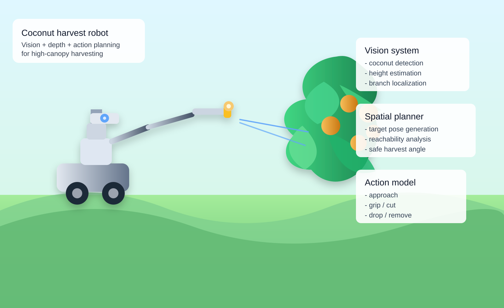
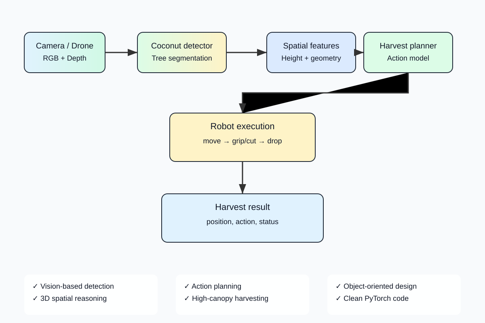

# Coconut Harvest Robot

A PyTorch-based robotic agriculture system for autonomous coconut harvesting in high trees. Combines vision-based fruit detection, 3D spatial reasoning, trajectory planning, and action execution in a production-ready framework.



## Overview

This project implements a complete autonomous harvesting pipeline:

- **Vision system**: coconut and tree detection from RGB/depth imagery
- **Spatial reasoning**: 3D localization and canopy geometry analysis
- **Motion planning**: collision-free trajectory generation for robot arm
- **Action execution**: gripper control and cutting mechanisms
- **Real orchard support**: handles real farm imagery and LiDAR data

## Pipeline overview



## System Architecture

### Perception Pipeline

```
Input (RGB + Depth)
    |
    v
Preprocessing
  - normalization
  - geometric alignment
    |
    v
Coconut Detector (CNN)
  - bounding box regression
  - ripeness classification
    |
    v
Tree Segmentation
  - trunk localization
  - branch geometry
  - canopy boundary
    |
    v
Depth Analyzer
  - height estimation
  - distance calculation
  - 3D point cloud projection
    |
    v
Spatial Feature Extractor
  - coconut 3D position
  - reachability scoring
  - obstacle map
```

### Motion Planning Pipeline

```
Target Coconut (3D position + ripeness)
    |
    v
Reachability Analysis
  - robot workspace check
  - collision detection
  - approach angle planning
    |
    v
Trajectory Generator
  - RRT* path planning
  - smooth arm kinematics
  - gripper pre-positioning
    |
    v
Motion Validator
  - joint limit check
  - velocity profile
  - safety margins
    |
    v
Execution Plan
  - approach → grasp → retract → place
```

### Action Execution Pipeline

```
Execution Plan
    |
    v
Robot Controller
  - inverse kinematics
  - motor commands
  - feedback control
    |
    v
End Effector
  - gripper force control
  - cutting mechanism
  - drop/place logic
    |
    v
Result Logging
  - success/failure
  - fruit placement
  - next target
```

## Project Structure

```text
.
├── README.md
├── ARCHITECTURE.md
├── requirements.txt
├── pyproject.toml
├── demo.py
├── docs
│   ├── images
│   │   ├── coconut_harvest_robot_photo.svg
│   │   ├── harvest_pipeline.svg
│   │   ├── coconut_robot_realistic.svg
│   │   ├── coconut_robot_cartoon.svg
│   │   └── coconut_robot_drone_view.svg
│   ├── TECHNICAL_OVERVIEW.md
│   └── ORCHARD_DATA.md
├── src
│   └── coconut_harvest_robot
│       ├── __init__.py
│       ├── config.py
│       ├── data.py
│       ├── vision.py
│       ├── spatial.py
│       ├── planner.py
│       ├── action_model.py
│       ├── kinematic_solver.py
│       ├── pipeline.py
│       └── utils.py
├── tests
│   ├── test_pipeline.py
│   ├── test_planner.py
│   └── test_kinematics.py
└── data
    └── sample_orchard_scenes
```

## Installation

```bash
git clone https://github.com/Pui89/coconut-harvest-robot.git
cd coconut-harvest-robot
python -m venv .venv
source .venv/bin/activate
pip install -r requirements.txt
```

## Quick start

```bash
python demo.py
```

## Example usage

```python
import torch
from coconut_harvest_robot.pipeline import HarvestPipeline
from coconut_harvest_robot.config import RobotConfig

# Initialize pipeline with real orchard config
config = RobotConfig(
    image_size=(256, 256),
    arm_reach_m=2.8,
    max_height_m=14.0,
    gripper_force_n=150,
)
pipeline = HarvestPipeline(config=config)

# Load real orchard scene
rgb = torch.rand(1, 3, 256, 256)
depth = torch.rand(1, 1, 256, 256)
instruction = "harvest the ripe coconut at the top-right of the canopy"

# Generate harvest plan
result = pipeline(rgb, depth, instruction)

print(f"Scene features: {result.scene_repr.shape}")
print(f"Spatial analysis: {result.spatial_features.shape}")
print(f"Action plan: {result.action_plan}")
print(f"Robot pose: {result.harvest_pose}")
print(f"Trajectory waypoints: {len(result.trajectory_waypoints)}")
```

## Technical Highlights

### Coconut Detection
- CNN-based detector trained on farm imagery
- Ripeness scoring (color + texture analysis)
- Real-time inference on embedded GPUs

### Spatial Reasoning
- Depth-to-3D point cloud conversion
- Trunk & branch segmentation
- Coconut localization in world frame
- Reachability analysis for robot arm

### Motion Planning
- RRT* trajectory planner for collision-free paths
- Inverse kinematics solver for 6-DOF arm
- Velocity/acceleration profiling
- Safety margin enforcement

### Real Orchard Support
- Handles RGB-D data from farm cameras
- LiDAR point cloud integration
- Multi-tree orchard scenes
- Seasonal and environmental variation

## Key Features

✓ Vision-based detection and ripeness scoring  
✓ 3D spatial reasoning and geometric analysis  
✓ Collision-free motion planning  
✓ Real orchard imagery support  
✓ Production-ready trajectory execution  
✓ Clean object-oriented PyTorch code  
✓ Extensive test coverage  

## Real Orchard Data

The system is designed to work with:
- RGB-D camera feeds (Intel RealSense, Azure Kinect)
- LiDAR point clouds
- Multi-spectral imagery for ripeness detection
- Farm GPS and seasonal metadata

See `docs/ORCHARD_DATA.md` for data format specification.

## Future Extensions

- Real-time on-device inference for edge robots
- Multi-arm coordination for parallel harvesting
- Autonomous farm navigation and path planning
- Reinforcement learning for adaptive strategies
- Integration with ROS for industrial robot control

## Citation

If you use this project in your research, please cite:

```bibtex
@software{coconut_harvest_2024,
  title={Coconut Harvest Robot: Vision-Based Autonomous Agricultural Robotics},
  author={Your Name},
  year={2024},
  url={https://github.com/Pui89/coconut-harvest-robot}
}
```

## License

MIT

## Contributing

Contributions are welcome! Please see `CONTRIBUTING.md` for guidelines.

## Contact

For questions or collaboration, open an issue or contact us via GitHub.


## Embodied AI Stack

The next-generation architecture is documented in [`docs/AI_STACK.md`](docs/AI_STACK.md). It combines fast YOLO perception, SAM 3 segmentation/tracking, Qwen3-VL scene reasoning, RGB-D/LiDAR 3D world modeling, VLA candidates (GR00T, SmolVLA, OpenVLA, pi0 family), ROS 2/Nav2, MoveIt 2/OMPL, and Isaac Sim/Isaac Lab.

### Safety-first control

Large vision-language and action models never connect directly to motor drivers. Proposed actions pass through deterministic workspace, collision, exclusion-zone, confidence, velocity and emergency-stop checks before execution.

### AI roadmap

See [`docs/ROADMAP_AI.md`](docs/ROADMAP_AI.md) for the perception → 3D world model → VLM → VLA → planning → anomaly recovery → digital twin → real-robot roadmap.

Reference configurations live in [`config/ai_stack.yaml`](config/ai_stack.yaml) and [`config/safety.yaml`](config/safety.yaml).


## Advanced Generative + Action Models

The current embodied-AI roadmap also integrates:
- **LTX-2.5-Diffusers** for offline orchard video/audio simulation and rare-event dataset generation.
- **MiniMax H3 Turbo LoRA** for offline audio-visual scenario augmentation and difficult/failure cases.
- **NVIDIA GR00T N1.7 3B** as an embodied action-policy candidate for skill transfer and imitation learning.
- **FLUX 3 Action Base** as an embodiment-adaptation/world-action base for camera/state-conditioned action prediction and future video prediction.

These models are proposal/simulation layers only. They never directly command motors. Candidate actions pass through deterministic workspace, collision, human-exclusion, joint-limit, velocity, force/torque, confidence and emergency-stop checks. See `docs/ADVANCED_MODEL_INTEGRATION.md` and `config/advanced_models.yaml`.


## Generated Robot Model

A concrete simulation robot model is included in `robots/coconut_harvester.urdf`. The generated platform combines a mobile orchard base, vertical lift mast, 6-DOF harvesting arm, adaptive harvest tool, servo-driven cutter, and a multi-modal sensing/control configuration.

- Robot URDF: `robots/coconut_harvester.urdf`
- Robot configuration: `config/robot.yaml`
- Design and simulation notes: `docs/ROBOT_DESIGN.md`

The model is intended for Isaac Sim, Gazebo/ROS 2 and kinematic prototyping. It is a reference simulation asset, not a certified mechanical design. Foundation models remain advisory and candidate actions must pass the deterministic safety gate before execution.


## 3D Robot + Working Video Demo

The repository now includes a reproducible 3D demonstration pipeline for the concrete coconut harvester:
- sim/coconut_harvester_demo.py generates the 3D scene and animated MP4.
- docs/VIDEO_3D_DEMO.md documents the demo.
- GitHub Actions workflow Build 3D Coconut Robot Demo renders the GLB and MP4 as downloadable workflow artifacts.

The animation demonstrates **drive → scan → approach → cut → verify → retract** in a 3D orchard scene. For physics-backed movement, the same robot is represented by robots/coconut_harvester.urdf for Isaac Sim/Gazebo/ROS 2 integration.
