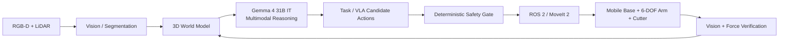

# Embodied AI Architecture — Gemma 4 31B IT

Gemma is advisory only. Candidate actions must pass workspace, collision, exclusion-zone, joint-limit, velocity/force and emergency-stop checks before hardware execution.

Model reference: https://huggingface.co/google/gemma-4-31B-it
