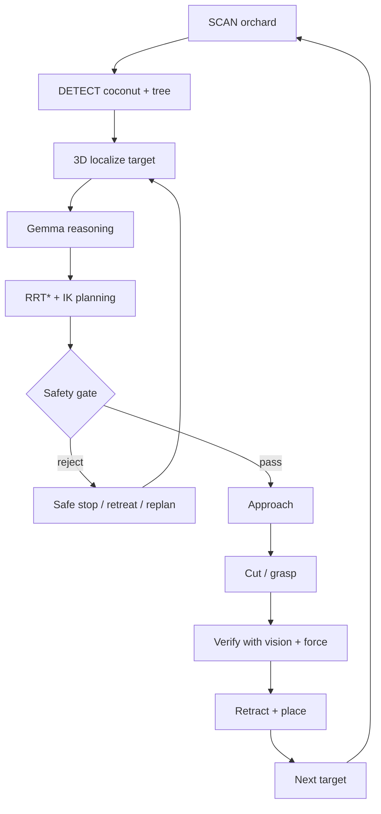

# Autonomous Harvest Workflow

```mermaid
flowchart TD
A[SCAN orchard] --> B[DETECT coconut + tree]
B --> C[3D localize target]
C --> D[Gemma reasoning]
D --> E[RRT* + IK planning]
E --> F{Safety gate}
F -- reject --> G[Safe stop / retreat / replan]
G --> C
F -- pass --> H[Approach]
H --> I[Cut / grasp]
I --> J[Verify with vision + force]
J --> K[Retract + place]
K --> L[Next target]
L --> A
```

The 4D representation treats each target as a time-indexed state containing position, velocity, confidence and reachability.
